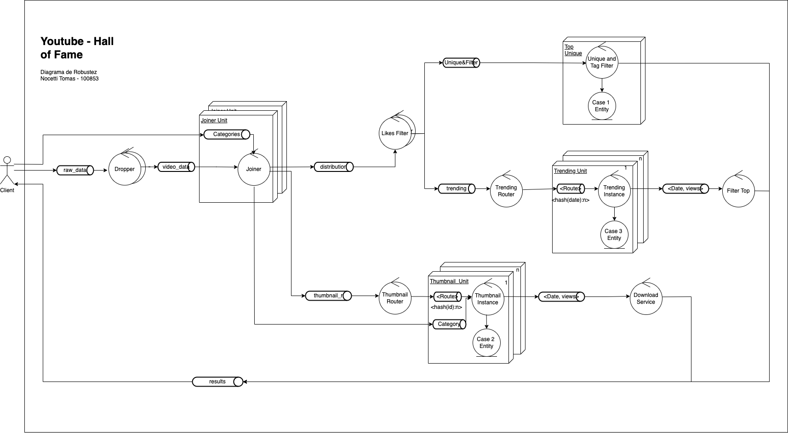

## Ejecucción

### Configuración

Para correr el sistema primero se debera generar un `docker-compose.yaml` con los paramteros
de escalamiento.
Dicho archivo se genera con el comando:

```
sh dfile_gen.sh <REPLICAS_JOINER> <REPLICAS_DROPPER> <REPLICAS_TRENDING> <REPLICAS_THUMBNAIL> <REPLICAS_LIKES_FILTER>
```

Se recomienda probar con 1 para cada valor e ir ajustando de acuerdo al flujo de mensajes que se puede visualizar directamente desde la consola de RabbitMQ.

Se debe tener en el `root` una carpeta `/raw_data` con los archivos a analizar. Se deja un ejemplo de la estructura de archivos en la carpeta `/data` que actua como set de prueba.

### Inicio

Para correr el programa se deben inicializar todos los servicios, esto se puede hacer con el comando:

```
make up
```

Esto levantara todos los servicios de procesamiento.
Finalmente para iniciar el programa se debera correr en otra terminal:

```
sh run_client.sh
```

## 4 + 1 Views

### Scope

Se solicita un sistema distribuido que analice los videos trending de
youtube de los últimos años.

- Los pares únicos de (id, title, category) de los videos etiquetados
  como 'funny' con más de 5M de likes.
- La descarga del thumbnail de aquellos videos que fueron trending por
  al menos 3 semanas en todos los países al mismo tiempo.
- El día con más vistas totales sobre los vídeos que recibieron más de
  5M de likes durante ese día.

Esto queda modelado con el siguiente diagrama de casos de uso:


#### Supuestos

Para el trabajo se supuso que el Cliente puede conectarse directamente con el sistema, sin tener que tener un punto de entrada en el mismo. Simulando un cliente en una red cerrada.

#### Desarrollo

Para el presente trabajo se usaron las siguientes tecnologias:

- RabbitMQ
- Docker
- Python3

### Software Architecture

La estructura del sistema se encuentra armada de manera modular, donde cada modulo tiene una responsabilidad especifica y se comunica solo con sus conocidos.

Los modulos o servicios son los siguientes:

- **Dropper**: se encarga de recibir los datos en crudo del cliente y eliminar la información que no sea necesaria para disminuir la carga en la comunicación entre servicios.
- **Joiner**: se encarga de recibir las categorias del cliente y recibir los datos del servicio `dropper` para hacer un join de la categoria.
- **Likes Filter**: se encarga de recibir los datos del `joiner` realizando un filtrado por > 5000000 de likes.
- **Trending Router**: se encarga de recibir los datos del `likes_filter` y aplicar un hashing al campo `date` que permite redireccionar el video a una instancia X para su analisis. Es importante aclarar que la cantidad de instancias de procesamiento (`trending_instance`) es dinámica.
- **Trending Instance**: se encarga de recibir los datos del `trending_router` y realizar un agrupamiento por fecha.
- **Filter Top**: se encarga de recibir los datos de las distintas `trinding_instances` y quedarse con el mayor valor, llegando al resultado del caso de uso 3.
- **Thumbnail Router**: se encarga de recibir los datos del `joiner` y mapear a una instancia cada dato segun su `video_id`.
- **Thumnail Instance**: se encarga de procesar los datos recibidos desde el `thumbnail_router` y agrupar por cantidad de dias y cantidad de paises diferentes.
- **Downloader**: se encarga de recibir los datos desde las distintas `thumbnail_instance` y descargar los thumnbails de los videos, finalizando el caso de uso 2.
- **Unique and Tag Filter**: se encarga de recibir los datos del `like_filter`, filtrar por tag='funny', y garantizar la unicidad, finalizando el caso de uso 1.

### Architectural Goals & Constraints

- Distribuir el procesamiento en unidades pequeñas y escalables.
- Utilizar un sistema de mensajeria para comunicar las distintas instancias.
-

### Logical View

Los siguientes diagramas explican en cada caso de uso como es el flujo de datos.

#### Caso de uso 1


#### Caso de uso 2


#### Caso de uso 3


### Process View

Se presentan los siguientes diagramas que explican algunas ideas de como funcionan los procesos.

- [Diagrama de Actividades que explica la interacción entre el Cliente/Dropper y Joiner](diagramas/drop-and-join-activity.png)

- [Diagrama de Secuencia que muestra el ruteo entre una Thumbnail Router y una instancia Routing Instance](diagramas/sequence_routing.png)

### Development View

Para la estructura general de desarrollo se uso el siguiente paquete modelo, donde cada paquete esta compuesto por un Worker y el Middleware.

- [Diagrama de Paquetes que explica el modelo basico Worker / Middleware utilizado](diagramas/package-joiner.png)

### Physical View

El sistema posee la siguiente arquitectura:



Cada módulo se encuentra deployado en un contenedor individual permitiendo de esta manera su escalabilidad. El sistema entero se encuentra comunicado a traves de una instancia de Rabbit MQ, conocida por todos.

Se puede visualizar en el siguiente diagrama:


### Problemas encontrados

A lo largo del desarrollo nos encontramos con algunos siguientes inconvenientes propios de RabbitMQ. Uno de ellos producia que una de las colas de rabbitmq obtenga mensajes ilimitadamente generando la perdida de la instancia. Esto era causado por el AutoACK en True. Una caracteristica que tiene el framework que permite confirmar la recepcion del mensaje apenas es entregado. Se soluciono difiriendo la confirmacion del mensaje.
