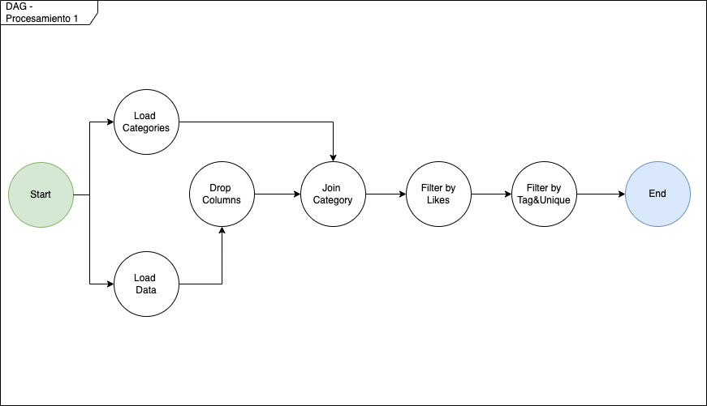
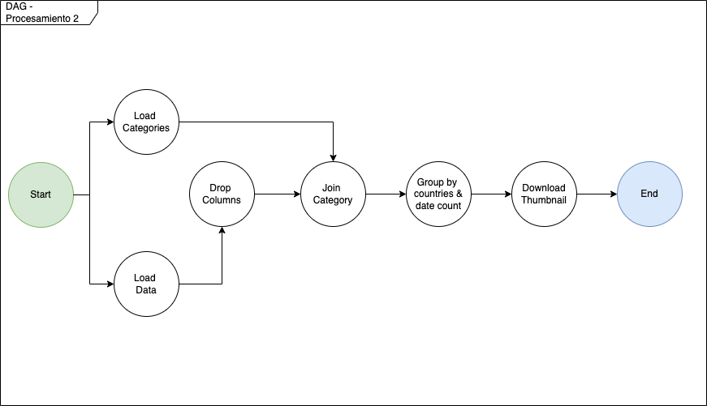
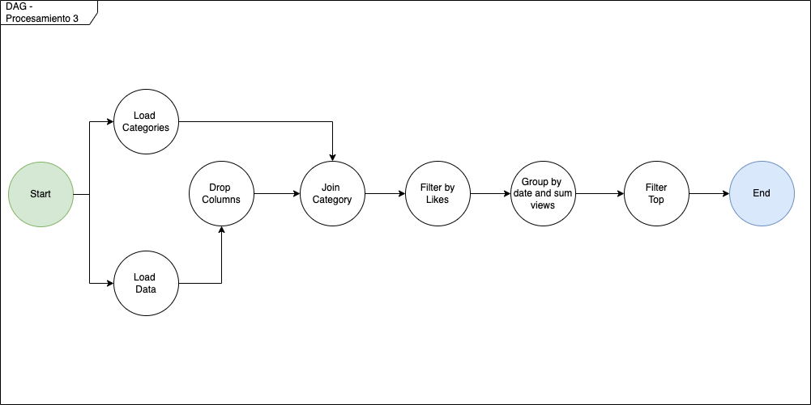
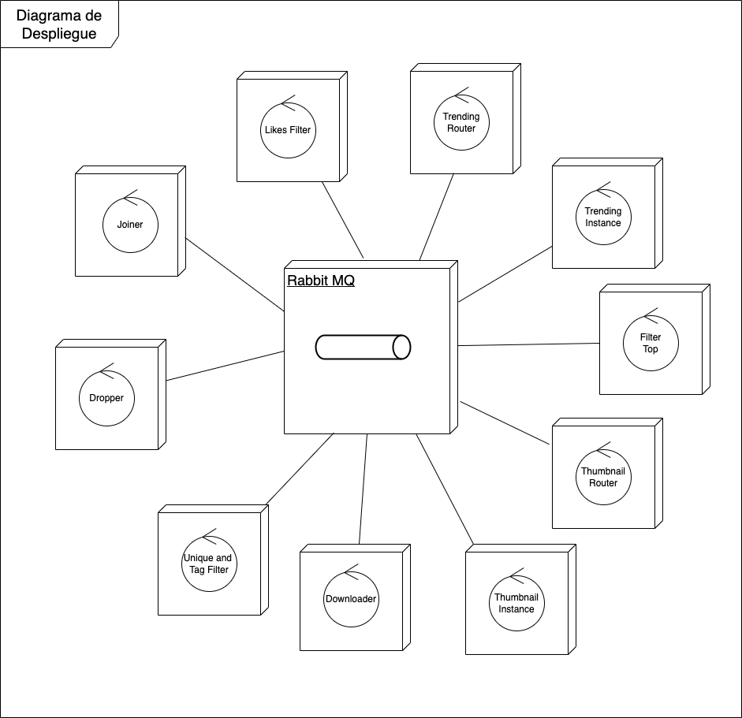

## Introduccion

Se solicita un sistema distribuido que analice los videos trending de
youtube de los últimos años.

### Se debe obtener:

- Los pares únicos de (id, title, category) de los videos etiquetados
  como 'funny' con más de 5M de likes.
- La descarga del thumbnail de aquellos videos que fueron trending por
  al menos 3 semanas en todos los países al mismo tiempo.
- El día con más vistas totales sobre los vídeos que recibieron más de
  5M de likes durante ese día.

Esto queda modelado con el siguiente diagrama de casos de uso:

### Supuestos

Para el trabajo se supuso que el Cliente puede conectarse directamente con el sistema, sin tener que tener un punto de entrada en el mismo. Simulando un cliente en una red cerrada.

## Servicios

La estructura del sistema se encuentra armada de manera modular, donde cada modulo tiene una responsabilidad especifica y se comunica solo con sus conocidos.

Los modulos o servicios son los siguientes:

- **Dropper**: se encarga de recibir los datos en crudo del cliente y eliminar la información que no sea necesaria para disminuir la carga en la comunicación entre servicios.
- **Joiner**: se encarga de recibir las categorias del cliente y recibir los datos del servicio `dropper` para hacer un join de la categoria.
- **Likes Filter**: se encarga de recibir los datos del `joiner` realizando un filtrado por > 5000000 de likes.
- **Trending Router**: se encarga de recibir los datos del `likes_filter` y aplicar un hashing al campo `date` que permite redireccionar el video a una instancia X para su analisis. Es importante aclarar que la cantidad de instancias de procesamiento (`trending_instance`) es dinámica.
- **Trending Instance**: se encarga de recibir los datos del `trending_router` y realizar un agrupamiento por fecha.
- **Filter Top**: se encarga de recibir los datos de las distintas `trinding_instances` y quedarse con el mayor valor, llegando al resultado del caso de uso 3.
- **Thumbnail Router**: se encarga de recibir los datos del `joiner` y mapear a una instancia cada dato segun su `video_id`.
- **Thumnail Instance**: se encarga de procesar los datos recibidos desde el `thumbnail_router` y agrupar por cantidad de dias y cantidad de paises diferentes.
- **Downloader**: se encarga de recibir los datos desde las distintas `thumbnail_instance` y descargar los thumnbails de los videos, finalizando el caso de uso 2.
- **Unique and Tag Filter**: se encarga de recibir los datos del `like_filter`, filtrar por tag='funny', y garantizar la unicidad, finalizando el caso de uso 1.

### Flujo de Datos

Los siguientes diagramas explican en cada caso de uso como es el flujo de datos.

#### Caso de uso 1

#### Caso de uso 2

#### Caso de uso 3

### Despliegue

Cada modulo se encuentra deployado en un contenedor individual permitiendo de esta manera su escalabilidad. El sistema entero se encuentra comunicado a traves de una instancia de Rabbit MQ, conocida por todos.

Se puede visualizar en el siguiente diagrama:

